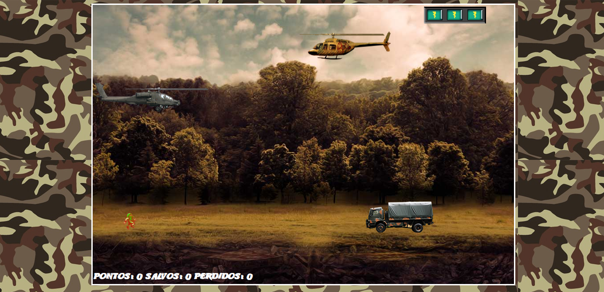

  

<h1 align="center">Construindo o seu primeiro jogo de naves Digital Innovation One</h1>

<h3>👨‍💻 Tecnologias utilizadas</h3>

- [HTML](https://www.w3schools.com/html/)
- [CSS](https://developer.mozilla.org/pt-BR/docs/Web/CSS)
- [JavaScript](https://developer.mozilla.org/en-US/docs/Web/JavaScript)
- [jQuery](https://jquery.com/)

 <h4 align=center>Made with by <a target="_blank" href="https://diegohfcelestino.github.io/portfolio/" >Diego Henrique Ferreira</a></h4>